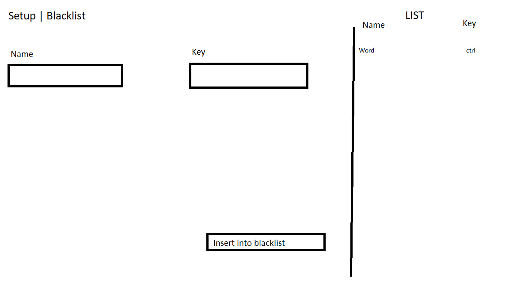

- [Introduzione](#introduzione)
  - [Informazioni sul progetto](#informazioni-sul-progetto)
  - [Abstract](#abstract)
  - [Scopo](#scopo)
- [Analisi](#analisi)
  - [Analisi del dominio](#analisi-del-dominio)
  - [Analisi e specifica dei requisiti](#analisi-e-specifica-dei-requisiti)
  - [Analisi dei mezzi](#analisi-dei-mezzi)
    - [Hardware:](#hardware)
    - [Software:](#software)
  - [Pianificazione](#pianificazione)
- [Progettazione](#progettazione)
  - [Design dell'archiettutra del sistema](#design-dellarchiettutra-del-sistema)

- [Introduzione](#introduzione)
  - [Informazioni sul progetto](#informazioni-sul-progetto)
  - [Abstract](#abstract)
  - [Scopo](#scopo)
- [Analisi](#analisi)
  - [Analisi del dominio](#analisi-del-dominio)
  - [Analisi e specifica dei requisiti](#analisi-e-specifica-dei-requisiti)
  - [Analisi dei mezzi](#analisi-dei-mezzi)
    - [Hardware:](#hardware)
    - [Software:](#software)
  - [Pianificazione](#pianificazione)
- [Progettazione](#progettazione)
  - [Design dell'archiettutra del sistema](#design-dellarchiettutra-del-sistema)

3. [Progettazione](#progettazione)
  - [Design dell’architettura del sistema](#design-dell’architettura-del-sistema)
4. [Implementazione](#implementazione)

5. [Test](#test)
  - [Protocollo di test](#protocollo-di-test)
  - [Risultati test](#risultati-test)
  - [Mancanze/limitazioni conosciute](#mancanze-limitazioni-conosciute)

6. [Consuntivo](#consuntivo)

7. [Conclusioni](#conclusioni)

  - [Sviluppi futuri](#sviluppi-futuri)
  - [Considerazioni personali](#considerazioni-personali)

8. [Sitografia](#sitografia)

9. [Allegati](#allegati)

# Introduzione 
## Informazioni sul progetto
- Allievo coinvolto: Nicola Anghileri
- Classe: I3BB
- Docenti responsabili: Luca Muggiasca, Geo Petrini
- Data inizio: 09.09.2021
- Data fine: 23.12.2021
## Abstract
> *Molti desktop manager Linux consentono il ridimensionamento delle finestre tramite una combinazione di tastiera e mouse, ad esempio Win+RClick+Trascinamento, rispettivamente spostamento con Win+LClick+Trascinamento (altre volte il tasto non è Win ma Alt), il tutto senza dover interagire direttamente con i bordi della finestra.*

## Scopo
L’obiettivo del progetto è lo sviluppo di un’applicazione che consenta il ridimensionamento di una finestra attraverso degli shortcut da tastiera + mouse click, tutto questo però disponibile sul sistema operativo Windows 10.

# Analisi

## Analisi del dominio

Dal committente è stato richiesto di creare un opzione come già esiste su molti desktop manager Linux, di ridimensionare una finestra aperta su Windows 10, solo attraverso degli shortcut con tastiera + mouse. Al centro della finestra verranno mostrati i dati seguenti: posizione della finestra (x, y), dimensioni della finestra (larghezza, altezza) in px. 

I dati spiegati in precedenza verranno aggiornati in tempo reale, si attiverà nel momento in cui lo shortcut viene eseguito e terminerà nel momento in cui i tasati relativi allo shortcut vengono rilasciati.

Inoltre le finestre che potranno essere ridimensionate saranno tutte quelle aperte nella sessione corrente, non solo la finestra aperta in primo piano.

Sarà presente una GUI nella quale si potranno decidere i comandi per lo shortcut, all'interno ci sarà anche un link per la pagina HTML nella quale sarà descritto tutto il funzionamento di questo programma.
 
Dalla GUI sarà anche possibile accedere ad una pagina (all'interno della GUI stessa) una blacklist nella quale si potranno aggiungere i programmi che già utilizzano lo shortcut del programma già per loro scopi.

## Analisi e specifica dei requisiti

|**ID**	|**Nome**			|**Priorità**|**Vers**|**Note**  |
|----|------------|--------|----|------|
|Req-001|Combinazione di tasti configurabile|1|1.0|L'utente potrà cambiare la configurazione di tasti tramite GUI o file di configurazione. |
|Req-002|Visualizzazione dei dati|1|1.0|Al centro della finestra dovrà essere mostrata la posizione della finestra (x, y), dimensioni della finestra (larghezza, altezza) in px.|
|Req-003|Aggiornamento dei dati in tempo reale|1|1.0|I dati spiegati nel Req-002 dovranno essere aggiornati in tempo reale.|
|Req-004|Visuale dati "dianamica"|1|1.0|I dati relativi al Req-002 devono apparire solo una volta che viene utilizzato lo shortcut e scomparire una volta che si rilasciano i tasti relativi allo shortcut.|
|Req-005|Tutte le finestre accessibile|1|1.0|Si devono potere ridimensionare ecc... tutte le finestre non solo quelle in primo piano.|
|Req-006|Icona Tray|1|1.0|L'applicativo deve avere una sua icona visibile nella Tray, dalla quale si devono poter effettuare questi comandi: chiusura, sospensione/ripristino, apertura della configurazione (GUI o file).|
|Req-007|Creazione Blacklist|1|1.0|Visto che alcune applicazioni potrebbero avere già riservato certe combinazioni di tasti, per questo motivo l'utente deve avere la possibilità di aggiungere queste applicazioni all'interno della blacklist, in modo da escluderle le finestre di quei applicativi.|
|Req-008|Programma portable|1|1.0|Il programma deve essere il più portable possibile e non deve richiedere diritti amministrativi (in questo caso è consentito ignorare finestre aperte con tali diritti).|
|Req-009|Doc esplicativo|1|1.0|Deve essere creato un documento o una pagina HTML esplicativo. |

## Analisi dei mezzi

### Hardware:
- iMAC 18,4 Intel Core i5-7360U, 2.30GHz, 16GB RAM, Windows 10 Enterprise.
- PC Desktop Intel Core i7.6820k, 3.60 GHz, 16GB RAM, Windows 10 Pro
### Software:
- Visual Studio Code
- AutoHotkey (Programming language)
- AutoIt (Programming language)
- Virtual Box per macchina virtuale visto che nella scuola arti e mestieri di trevano non si possono scaricare i tool utili per un progetto scolastico.

## Pianificazione
Per la pianificazione allego il gant iniziale / preventivo:

# Progettazione

La GUI che sarà caricata per questo progetto dovrà presentare diverse features, la prima pagina di setup per la shortcut dovrà dare all'utente la possibilità di cambiare il tasto della tastiera che farà partire il programma, e anche che tasto del mouse verra utilizzato per fare il resize o corrispettivo spostamento della pagina. Tutto questo potrà essere salvato con il tasto "Save setup" oppure resettato con i valori di default con il tasto "Reset setup".

Nella seconda tab della GUI sarà presente la possibilità di aggiungere un programma nella "blacklist", cioè man mano che l'utente utilizzerà questo programma si accorgerà che alcuno programmi hanno già riservato delle shortcut, purtroppo certe di queste andrebbero in conflitto con le nostre messe.
Una volta che l'utente trova una shortcut bloccata, potrà aprire la GUI ed inserire il programma con il suo tasto riservato. In questo modo la GUI ne terrà conto la prossima volta e avviserà l'utente per tempo. 

## Design dell'archiettutra del sistema

