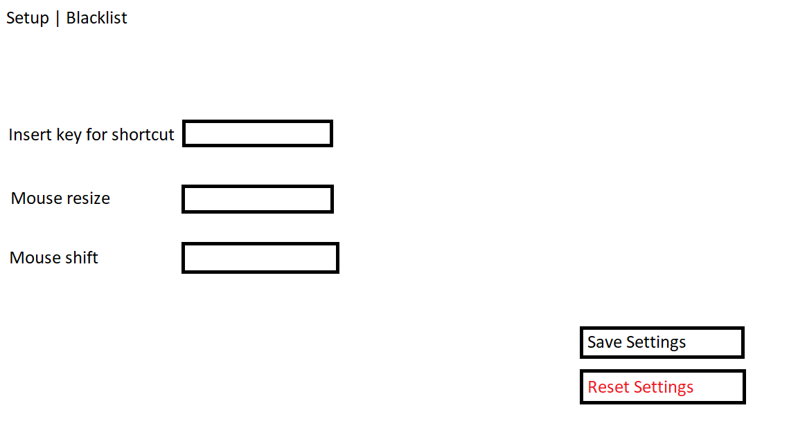

1. [Introduzione](#introduzione)

  - [Informazioni sul progetto](#informazioni-sul-progetto)

  - [Abstract](#abstract)

  - [Scopo](#scopo)

2. [Analisi](#analisi)

  - [Analisi del dominio](#analisi-del-dominio)
  
  - [Analisi dei mezzi](#analisi-dei-mezzi)

  - [Analisi e specifica dei requisiti](#analisi-e-specifica-dei-requisiti)

  - [Use case](#use-case)

  - [Pianificazione](#pianificazione)

3. [Progettazione](#progettazione)

  - [Design dell’architettura del sistema](#design-dell’architettura-del-sistema)

  - [Design dei dati e database](#design-dei-dati-e-database)

4. [Implementazione](#implementazione)

5. [Test](#test)

  - [Protocollo di test](#protocollo-di-test)

  - [Risultati test](#risultati-test)

  - [Mancanze/limitazioni conosciute](#mancanze/limitazioni-conosciute)

6. [Consuntivo](#consuntivo)

7. [Conclusioni](#conclusioni)

  - [Sviluppi futuri](#sviluppi-futuri)

  - [Considerazioni personali](#considerazioni-personali)

8. [Sitografia](#sitografia)

9. [Allegati](#allegati)

# Introduzione 
## Informazioni sul progetto
- Allievo coinvolto: Nicola Anghileri
- Classe: I3BB
- Docenti responsabili: Luca Muggiasca, Geo Petrini
- Data inizio: 09.09.2021
- Data fine: 23.12.2021
  
## Abstract
> *Molti desktop manager Linux consentono il ridimensionamento delle finestre tramite una combinazione di tastiera e mouse, ad esempio Win+RClick+Trascinamento, rispettivamente spostamento con Win+LClick+Trascinamento (altre volte il tasto non è Win ma Alt), il tutto senza dover interagire direttamente con i bordi della finestra.*

## Scopo
L’obiettivo del progetto è lo sviluppo di un’applicazione che consenta il ridimensionamento di una finestra attraverso degli shortcut da tastiera + mouse click, tutto questo però disponibile sul sistema operativo Windows 10.

# Analisi

## Analisi del dominio

Dal committente è stato richiesto di creare un opzione come già esiste su molti desktop manager Linux, di ridimensionare una finestra aperta su Windows 10, solo attraverso degli shortcut con tastiera + mouse. Al centro della finestra verranno mostrati i dati seguenti: posizione della finestra (x, y), dimensioni della finestra (larghezza, altezza) in px. 

I dati spiegati in precedenza verranno aggiornati in tempo reale, si attiverà nel momento in cui lo shortcut viene eseguito e terminerà nel momento in cui i tasati relativi allo shortcut vengono rilasciati.

Inoltre le finestre che potranno essere ridimensionate saranno tutte quelle aperte nella sessione corrente, non solo la finestra aperta in primo piano.

Sarà presente una GUI nella quale si potranno decidere i comandi per lo shortcut, all'interno ci sarà anche un link per la pagina HTML nella quale sarà descritto tutto il funzionamento di questo programma.
 
Dalla GUI sarà anche possibile accedere ad una pagina (all'interno della GUI stessa) una blacklist nella quale si potranno aggiungere i programmi che già utilizzano lo shortcut del programma già per loro scopi.

## Analisi e specifica dei requisiti

|**ID**	|**Nome**			|**Priorità**|**Vers**|**Note**  |
|----|------------|--------|----|------|
|Req-001|Combinazione di tasti configurabile|1|1.0|L'utente potrà cambiare la configurazione di tasti tramite GUI o file di configurazione. |
|Req-002|Visualizzazione dei dati|1|1.0|Al centro della finestra dovrà essere mostrata la posizione della finestra (x, y), dimensioni della finestra (larghezza, altezza) in px.|
|Req-003|Aggiornamento dei dati in tempo reale|1|1.0|I dati spiegati nel Req-002 dovranno essere aggiornati in tempo reale.|
|Req-004|Visuale dati "dianamica"|1|1.0|I dati relativi al Req-002 devono apparire solo una volta che viene utilizzato lo shortcut e scomparire una volta che si rilasciano i tasti relativi allo shortcut.|
|Req-005|Tutte le finestre accessibile|1|1.0|Si devono potere ridimensionare ecc... tutte le finestre non solo quelle in primo piano.|
|Req-006|Icona Tray|1|1.0|L'applicativo deve avere una sua icona visibile nella Tray, dalla quale si devono poter effettuare questi comandi: chiusura, sospensione/ripristino, apertura della configurazione (GUI o file).|
|Req-007|Creazione Blacklist|1|1.0|Visto che alcune applicazioni potrebbero avere già riservato certe combinazioni di tasti, per questo motivo l'utente deve avere la possibilità di aggiungere queste applicazioni all'interno della blacklist, in modo da escluderle le finestre di quei applicativi.|
|Req-008|Programma portable|1|1.0|Il programma deve essere il più portable possibile e non deve richiedere diritti amministrativi (in questo caso è consentito ignorare finestre aperte con tali diritti).|
|Req-009|Doc esplicativo|3|1.0|Deve essere creato un documento o una pagina HTML esplicativo. |

## Analisi dei mezzi

### Hardware:
- iMAC 18,4 Intel Core i5-7360U, 2.30GHz, 16GB RAM, Windows 10 Enterprise.
- PC Desktop Intel Core i7.6820k, 3.60 GHz, 16GB RAM, Windows 10 Pro
### Software:
- Visual Studio Code
- AutoHotkey (Programming language)
- Virtual Box per macchina virtuale visto che nella scuola arti e mestieri di trevano non si possono scaricare i tool utili per un progetto scolastico.

## Pianificazione
Per la pianificazione allego il gannt iniziale / preventivo:


# Progettazione

## Design dell'architettutra del sistema

La GUI che sarà caricata per questo progetto dovrà presentare diverse features, la prima pagina di setup per la shortcut dovrà dare all'utente la possibilità di cambiare il tasto della tastiera che farà partire il programma, e anche che tasto del mouse verrà utilizzato per fare il resize o corrispettivo spostamento della pagina. Tutto questo potrà essere salvato con il tasto "Save setup" oppure resettato con i valori di default con il tasto "Reset setup".




Nella seconda tab della GUI sarà presente la possibilità di aggiungere un programma nella "blacklist", cioè man mano che l'utente utilizzerà questo programma si accorgerà che alcuno programmi hanno già riservato delle shortcut, purtroppo certe di queste andrebbero in conflitto con le nostre messe.
Una volta che l'utente trova una shortcut bloccata, potrà aprire la GUI ed inserire il programma con il suo tasto riservato. In questo modo la GUI ne terrà conto la prossima volta e avviserà l'utente per tempo. 


# Implementazione
In questo progetto ci sono tre parti principali importanti:
 - **GUI**
 - **Script**
 - **config.ini**
  
### config.ini
Per prima cosa, vista la decisione presa di fare sia una GUI che un file configurazione, si andrà a progettare come sarà fatto il file di configurazione, visto che entrambi i programmi andranno ad utilizzarlo.

E il file di configurazione sarà così:
``` JSX
[Keys]
ResizeKeyboard=LControl
ResizeMouse=LButton
ShiftKeyboard=LControl
ShiftMouse=RButton
[Programs]
0=Visual Studio Code LControl LButton  
```
Possiamo vedere due categorie:
- [Keys] è il contenitore per le varie combinazioni di tasti "hotkeys".
- - ResizeKeyboard = Il tasto della tastiera per il ridimensionamento.
- - ResizeMouse = Il tasto del mouse per il ridimensionamento.
- - ShiftKeyboard = Il tasto della tastiera per lo spostamento.
- - ShiftMouse = Il tasto del mouse per lo spostamento.
- [Programs] è il contenitore per i programmi contenuti nella blacklist.
- - 0 = L'indice della lista.
- 
### Script
Per seconda cosa ho cominciato con la parte "Core" dell'applicazione, quindi la creazione di uno script che andrà a fare tutto il lavoro principale dell'applicazione, che sono lo spostamento e il ridimensionamento della finestra, utilizzando delle "Hotkey", che sono delle combinazioni di tasti che una volta premuti, lo script inizierà a funzionare e a spostare la finestra selezionata.

Il linguaggio di scripting che ho utilizzato si chiama AutoHotkey, non è un linguaggio molto utilizzato ma molto utile per quello che era bisogno per questa applicazione.
``` JSX
;Reads the infos for resize hotkey in config.ini
IniRead, resKeyboard, config.ini, Keys, ResizeKeyboard,
IniRead, resMouse, config.ini, Keys, ResizeMouse,

;Reads the infos for window shift hotkey in config.ini
IniRead, shiftKeyboard, config.ini, Keys, ShiftKeyboard,
IniRead, shiftMouse, config.ini, Keys, ShiftMouse,
```
Per leggere i contenuti delle varie combinazioni di tasti utilizzo il metodo IniRead, che funziona con questi valori:

IniRead, OutputVar, Filename, Section, Key,

OutputVar = La variabile nella quale andrà salvato il risultato del metodo.
Filename = Il nome del file .ini dal quale verranno prese le informazioni.
Section = La sezione all'interno del file da prendere in considerazione.
Key = La chiave del valore da dover leggere.

Per il requisito di poter accedere alla GUI da System Tray si usa questo comando:
``` JSX
Menu, Tray, Add, GUI, gui

gui:
    Run, MouseResize.GUI.exe
```
Facendo questo aggiungo al menu, in questo caso alla Tray dello script, un pulsante con nome "GUI", cliccandolo partirà il Label*, che a sua volta farà partire il file eseguibile della gui stessa contenuta nella stessa cartella del file.
*Un Label serve semplicemente a dare un nome ad un pezzo di codice all'inerno dello script.

Usando il comando "CoordMode" definisco che il sistema di riferimento per recuperare le posizioni del mouse deve essere in base allo schermo intero (Screen).
``` JSX
CoordMode, Mouse, Screen
```
Arrivando alla parte principale dello script, troviamo un Label "Main" che contiene la parte di ridimensionamento e di spostamento.

All'interno di un Loop troviamo due parti, se la variabile flag contiene il valore 1, sarà stata premuta la combinazione di tasti per lo spostamento, se contiene il valore 2 è premuta quella per il ridimensionamento.

Per lo spostamento il procedimento è molto veloce:
``` JSX
if(flag == 1){
  ;Check if key-combination for shifting window is pressed.
  if (GetKeyState(resKey, "P") And GetKeyState(resMou, "P")){ 
    ;Print infos next to the cursor.
    ToolTip, "X: "%XInfo%" Y: "%YInfo%" W: "%WInfo% " H: "%Height%        
    WinMove, %WindowTitle% , , WinX + spostX,WinY + spostY ,  
  }else{
    flag := -1
    ToolTip,
    Break
  }
}
```
Il primo controllo è il valore della variabile flag di cui ho parlato in precedenza, dopodiché si deve controllare se la combinazioni di tasti è ancora premuta, questo viene fatto controllando con il metodo GetKeyState(), questo metodo ritorna un valore booleano, se il tasto passato come primo parametro è premuto, che viene definito come secondo parametro del metodo con "P".

Se è così allora stamperò valori della posizione del mouse e della pagina grazie al metodo ToolTip, che mostra dei valori accanto al cursore del mouse.
``` JSX
if (GetKeyState(resKey, "P") And GetKeyState(resMou, "P")){ 
  ...
}
```
Con il metodo WinMove, posso spostare la finestra in un certa posizione, calcolando lo spostamento del mouse da quando la combinazione è stata premuta e sommandola alla posizione vecchia della finestra provocherò uno spostamento della finestra.
``` JSX
WinMove, %WindowTitle% , , WinX + spostX,WinY + spostY ,
```
Se la combinazione di tasti non è più premuta, cambio il valore della variabile flag a -1, in modo da non entrare più nelle condizioni, poi dovrò stampare "il nulla" con ToolTip, in modo che quando l'utente non utilizza la combinazione di tasti non veda valori che disturbano e poi con il comando "Break" esco completamente dal "Loop".
``` JSX
else{
    flag := -1
    ToolTip,
    Break
  }
```

Per il ridimensionamento ho prima di tutto creato un metodo che mi divide la finesta selezionata in 4 parti viruali, e che mi ritorna in quale delle 4 parti si trova il cursore, questo lo faccio perchè in base a quale posizione ha il cursore il ridimensionamento della finestra è diverso.

Tutto questo viene fatto dal metodo getSector(X,Y,WinX, WinY,WinWidth,WinHeight):
``` JSX
getSector(X,Y,WinX, WinY,WinWidth,WinHeight)
{
    S := -1
    if(X > WinX and X < (WinWidth/2 + WinX)){
        if(Y > WinY and Y < (WinHeight/2 + WinY)){
            S := 1
        }else if(Y > (WinY + WinHeight/2) and Y < (WinY +WinHeight)){
            S := 3
        } 
    }else if(X > (WinX + WinWidth/2) and X < (WinX + WinWidth)){
        if(Y > WinY and Y < (WinY + WinHeight/2)){
            S := 2
        }else if(Y > (WinY + WinHeight/2) and Y < (WinY +WinHeight)){
            S := 4
        } 
    }
    return %S%
}
```
Come parametri troviamo:
- X: La posizione del mouse sull'asse delle x.
- Y: La posizione del mouse sull'asse delle y.
- WinX: La posizione dell'angolo in alto a sinistra della finestra sull'asse delle X.
- WinY: La posizione dell'angolo in alto a sinistra della finestra sull'asse delle X.
- WinWidth: La larghezza della finestra.
- WinHeight: L'altezza della finestra.

Questo metodo controlla per ogni settore se il cursore è all'inerno dei limiti fissati se non lo è allora esso ritornerà -1.

Questo metodo viene utilizzato nel Label generale "Main" nel quale come secondo controllo, guardo se il contenuto della variabile flag è di 2, se sì allora dovrò eseguire il ridimensionamento in base al valore di uscita del metodo getSector.

``` JSX
}else if(flag == 2){
  ;Check if key-combination for resize is pressed.
  if (GetKeyState(shiftKey, "P") And GetKeyState(shiftMou,"P")){
    ;Print infos next to the cursor.
    ToolTip, "X: "%XInfo%" Y: "%YInfo%" W: "%WInfo% " H: "%Height%
    Sec := getSector(Xn,Yn,WinX,WinY,WinWidth,WinHeight)
    Switch Sec
    {
      Case 1:
        WinMove, %WindowTitle% , , WinX + spostX, WinY + spostY , WinWidth - spostX, WinHeight - spostY  
      Case 2:
        WinMove, %WindowTitle% , , , WinY + spostY, WinWidth + spostX, WinHeight - spostY
      Case 3:
        WinMove, %WindowTitle% , , WinX + spostX, , WinWidth - spostX, WinHeight + spostY
      Case 4:
        WinMove, %WindowTitle% , , , , WinWidth + spostX , WinHeight + spostY,
    }else{
      flag := -1
      ToolTip,
      Break
    }
  }
}
```

Come già spiegato nel metodo precendente, controllo se la combinazione di tasti è ancora premuta, se si allora continuo stampando i valori con ToolTip, dopodiché istanzio una variabile "Sec" che sta per "Sector" la quale conterrà il numero del settore nel quale si trova il mouse.
``` JSX
 Sec := getSector(Xn,Yn,WinX,WinY,WinWidth,WinHeight)
```
In base a questo con uno Switch andrò a filtrare le varie possibilità:
``` JSX
Switch Sec
    {
      Case 1:
        WinMove, %WindowTitle% , , WinX + spostX, WinY + spostY , WinWidth - spostX, WinHeight - spostY  
      Case 2:
        WinMove, %WindowTitle% , , , WinY + spostY, WinWidth + spostX, WinHeight - spostY
      Case 3:
        WinMove, %WindowTitle% , , WinX + spostX, , WinWidth - spostX, WinHeight + spostY
      Case 4:
        WinMove, %WindowTitle% , , , , WinWidth + spostX , WinHeight + spostY,
    }
```
Per ogni settore dovrò andare a modificare la finestra in modo diverso, la modifica delle dimensioni della finestra vengono fatte con il metodo WinMove, come già per lo spostamento della pagine.

Posizione dei settori:
- Primo: In alto a sinistra.
- Secondo: In alto a destra.
- Terzo: In basso a sinistra.
- Quarto: In basso a destra.

Cosa verrà modificato in base a che quadrante?

- Se il cursore è presente nel primo quadrante andrà modificata l'origine della finestra, sia X che Y ma anche la lunghezza e larghezza.

- Se è nel secondo quadrante, andrà modificato solamente modificare il valore Y dell'origine e la lunghezza e la larghezza.

- Se è nel terzo quadrante, andrà modificato il valore X dell'origine della finestra e la larghezza e lunghezza della finestra.

- Nel quarto verranno modificate solo la larghezza e la lunghezza.

Lo switch non gestisce il caso del -1 perchè tanto l'applicazione non dovrà fare nulla se il cursore si trova al di fuori della finestra.

### GUI

#### Visualizzazione grafica
La GUI effettiva è uscita differente da come era stata pianificata a inizio progetto. Essa serve alla manipolazione del file di configurazione per avere un sistema più User Friendly, infatti si presenterà così:


Nella schermata principale possiamo vedere 3 parti:

- 1: La parte di configurazione per le combinazioni di tasti per lo spostamento e ridimensionamento, grazie a dei menu a tendina possiamo trovare in quelli a sinistra i tasti per la tastiera, e a destra i tasti del mouse.
- 2: In questa tabella si potranno visualizzare tutti i programmi con le relative combinazione di tasti che vengono bloccate / già utilizzate, con il tasto "+" si aprirà una nuova finestra nella quale si inseriranno i dati per aggiungere un elemento alla lista, e selezionando un elemento della lista (cliccandoci sopra) e poi cliccando sul tasto "-" l'elemento selezionato verrà eliminato.
- 3: Con il tasto "Reset" verranno inseriti i valori di default per le combinazioni di tasti, con il tasto "Apply" verranno salvate le modifiche sia alle combinazioni di tasti che a alla "Blacklist" e in fine con il tasto "Close" verrà chiusa la finestra.

Possiamo vedere qui sotto la finestra utile all'inserimento di un elemento alla "Blacklist" delle combinazioni tra programmi e hotkey:


Anche qui abbiamo 3 parti importanti da spiegare:

- 4: In questa parte bisognerà aggiungere il nome del Programma.
- 5: Con questi menu a tendina bisognerà selezionare la combinazioni di tasti che si vuole "vietare" dal programma scritto sopra.
- 6: Con il tasto "Add" si aggiungerà il programma alla lista e con il tasto "Close" la finestra si chiuderà.

#### Codice

Questa GUI è stata creata con Windows Forms su Visual Studio 2019, adesso inizierà una piccola parte di spiegazione di codice che è presente dietro a tutta questa GUI, come vengono popolati i menu a tendina, come funziona l'aggiunta e la rimozione di elementi presenti nella Blacklist e come funziona la scrittura sul file di configurazione.

#### Caricamento della GUI


Qui sotto troviamo il metodo che viene invocato quando la GUI parte, cioè quando il file eseguibile (.exe) viene fatto partire. Fondamentalmente vengono solo popolati i 4 menu a tendina per le combinazioni di tasti prendendo i valori dalle due classi Enum che si chimano KeyboardKey e MouseKey. Le due classi enum contengono semplicemente i vari nomi dei tasti da scegliere.

``` JSX
private void Form1_Load(object sender, EventArgs e)
{
  foreach (KeyboardKey key in (KeyboardKey[]) Enum.GetValues(typeof(KeyboardKey)))
  {
    cbKeyMove.Items.Add(key.ToString());
    cbKeyResize.Items.Add(key.ToString());
  }

  foreach (MouseKey key in (MouseKey[])Enum.GetValues(typeof(MouseKey)))
  {
    cbMouseMove.Items.Add(key.ToString());
    cbMouseResize.Items.Add(key.ToString());
  }
}
```
#### Aggiunta valore alla blacklist

Per l'aggiunta di un nuovo valore alla Blacklist viene aperta una nuova finestra, chiamata anche Form.

``` JSX
private void bAdd_Click(object sender, EventArgs e)
{
  Item f2 = new Item(this);
  f2.ShowDialog();
}
```
Viene creato un nuovo oggetto di tipo Item, l'oggetto Item contiene tutte le informazioni della finestra per inserire il programma, e dopodiché con il metodo ShowDialog mostro la finestra.

#### Eliminazione valore dalla blacklist

``` JSX
private void bDelete_Click(object sender, EventArgs e)
{
  ListBox blacklist = lbBlacklist;
  blacklist.Items.Remove(blacklist.SelectedItem);
}
```
Possiamo vedere che viene istanziato un oggetto ListBox che fa referenza alla ListBox presente nella GUI.
Dopo questo viene passato come parametro del metodo Remove(), l'elemento selezionato all'inerno della lista.

Facendo così se si clicca un elemento lo si seleziona e una volta cliccato il bottone "-" questo metodo partirà a lo eliminerà perchè è come parametro del metodo Remove.

#### Salvataggio dati nel file config.ini

Per salvare i dati all'interno del file config.ini utilizzo una classe già esistente che si chiama IniFile.cs, essa è utile per il salvataggio e alla lettura dei dati all'interno del file.
``` JSX
private void bApply_Click(object sender, EventArgs e)
{
  //Using class IniFile to create or override ini file
  var MyIni = new IniFile("config.ini");

  //Readed values
  MyIni.Write("ResizeKeyboard", cbKeyResize.Text, "Keys");
  MyIni.Write("ResizeMouse", cbMouseResize.Text, "Keys");
  MyIni.Write("ShiftKeyboard", cbMouseResize.Text, "Keys");
  MyIni.Write("ShiftMouse", cbMouseResize.Text, "Keys");

  //defaults
  if (cbKeyResize.Text.Length == 0)
  {
    MyIni.Write("ResizeKeyboard", "LControl", "Keys");
  }
  if (cbMouseResize.Text.Length == 0)
  {
    MyIni.Write("ResizeMouse", "LButton", "Keys");
  }
  if (cbKeyMove.Text.Length == 0)
  {
    MyIni.Write("ShiftKeyboard", "LControl", "Keys");
  }
  if (cbMouseMove.Text.Length == 0)
  {
    MyIni.Write("ShiftMouse", "RButton", "Keys");
  }

  int count = 0;
  foreach(var item in lbBlacklist.Items)
  {
    MyIni.Write(count.ToString(), item.ToString(), "Programs");
    count++;
  }
}
```
La prima parte consiste nel creare una classe IniFile, che poi servirà per utilizzare tutti i metodi che ha al suo interno.

Dopo questo vado a scrivere tutti i valori che sono andato a leggere, che l'utente ha selezionato dai menu a tendina per le combinazioni di tasti.


``` JSX
var MyIni = new IniFile("config.ini");

  //Readed values
  MyIni.Write("ResizeKeyboard", cbKeyResize.Text, "Keys");
  MyIni.Write("ResizeMouse", cbMouseResize.Text, "Keys");
  MyIni.Write("ShiftKeyboard", cbMouseResize.Text, "Keys");
  MyIni.Write("ShiftMouse", cbMouseResize.Text, "Keys");
```

Dopo questo, se dei valori sono nulli o la loro lunghezza è uguale a 0, vuol dire che l'utente si è dimenticato di inserire un valore, quindi il programma inserirà i valori di default.


``` JSX
if (cbKeyResize.Text.Length == 0)
  {
    MyIni.Write("ResizeKeyboard", "LControl", "Keys");
  }
  if (cbMouseResize.Text.Length == 0)
  {
    MyIni.Write("ResizeMouse", "LButton", "Keys");
  }
  if (cbKeyMove.Text.Length == 0)
  {
    MyIni.Write("ShiftKeyboard", "LControl", "Keys");
  }
  if (cbMouseMove.Text.Length == 0)
  {
    MyIni.Write("ShiftMouse", "RButton", "Keys");
  }
```

E alla fine si dovranno scrivere sul file di configurazione pure tutti i valori contenuti nella blacklist, questo viene fatto facendo passare tutti gli elementi contenuti, convertendoli in valori di tipo stringa e poi scrivendoli grazie al metodo giâ fornito "Write".
Ad ogni programma inserito verrà data una "key" equivalente ad un numero incrementale partendo da 0.
``` JSX
int count = 0;
  foreach(var item in lbBlacklist.Items)
  {
    MyIni.Write(count.ToString(), item.ToString(), "Programs");
    count++;
  }
```
## Mancanze/limitazioni conosciute
Mancano pochi dettagli che porterebbero questo programma ad essere comodo al 100% senza dover fare dei passaggi inutili, come ad esempio come viene gestita la blacklist dallo script, oppure il non caricamento dei programmi già inseriti in precedenza nella blacklist.

# Consuntivo


Purtroppo il Gannt creato all'inizio del progetto è molto basilare viste le mie mancate conoscenze sul campo. 
Per colpa di questa basilarità quindi è molto difficile fare un commento, però il tempo è stato utilizzato nel migliore dei modi, non è stato sprecato e anche i tempi stimati non erano troppo diversi dai tempi effettivamente utilizzati.

# Conclusioni

Questa applicazioni a mio parere è molto utile, questo è stato anche il motivo per cui ho deciso di lavorarci. Se si hanno degli schermi più grandi del solito o quando una finestra viene per sbaglio spostata nell'angolo dello schermo e non si riesce a selezionarla per riportarla nella posizione iniziale, questo programmino senza alcun problema ti aiuta a spostarla.

Il problema di dover sempre selezionare il bordo del programma per poterla ridimensionare con questo programma sparisce! Mai più ci si dovrà arrabbiare inutilmente.

E se per caso si vuole passare questo programma ad un amico, esso avrà anche già con lui la lista dei programmi con tu hai riscontrato problemi visto che certe combinazioni vengono già utilizzate. Basterà aprire la GUI e controllarle.
E anche per cambiare le combinazioni basterà aprire la GUI e cambiarle grazie al menu a tendina in 10 secondi è finito.

## Sviluppi futuri
Ci sono dei piccoli cambiamenti che si potrebbero fare:
- Aggiungere la lettura dal file di configurazione da parte della GUI per poter caricare i programmi della blacklist.
- Un avvertimento da parte dello script se si apre un programma che è contenuto nella blacklist.
- Lavorare con il problema della velocità di reazione da parte del ridimensionamento della finestra.
## Considerazioni personali
Mi è piaciuto molto lavorare con questo progetto perchè è stata la mia prima esperienza, è stato molto difficile dover imparare un nuovo linguaggio totalmente da zero, anche perchè Autohotkey è un linguaggio diverso da quelli già usati in precedenza, spero di aver creato un buon prodotto e che a qualcuno possa essere utile utilizzarlo.
# Sitografia
- https://www.autohotkey.com/docs/AutoHotkey.htm
- https://stackoverflow.com/questions/217902/reading-writing-an-ini-file
  
# Allegati

## Diari di Lavoro


